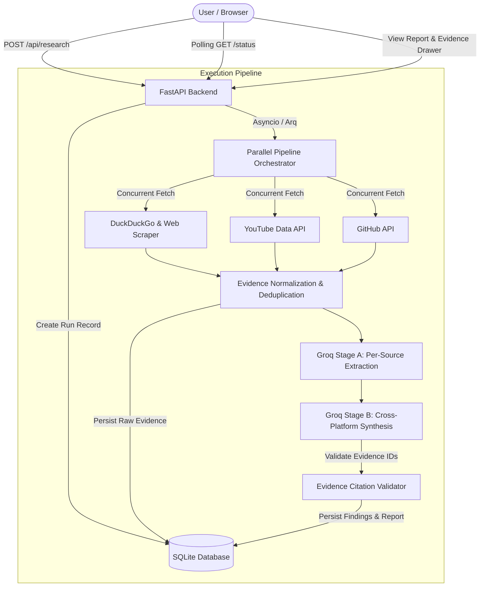

# 📡 SignalMap AI — Autonomous Market & Tech Intelligence Engine

> **Every finding mathematically traceable to hard evidence.** Concurrently crawls Web, YouTube, and GitHub sources to synthesize structured, evidence-backed market intelligence using two-stage Groq LLM synthesis.


---

## 🌟 Key Features

- **🌐 Multi-Source Concurrent Ingestion**:
  - **Live Web Search & Scraping**: Powered by live DuckDuckGo search + `httpx` and `BeautifulSoup4` with automatic JS rendering fallback.
  - **YouTube Data API v3**: Extracts video transcripts, metadata, view/like counts, and channel author insights.
  - **GitHub API Integration**: Analyzes repository stars, topics, open issues, commit velocity, and README content.

- **🤖 Two-Stage Groq Dual-Synthesis**:
  - **Stage A (Per-Source Analysis)**: Parallel JSON-mode LLM extraction isolated to individual source evidence blocks.
  - **Stage B (Cross-Platform Synthesis)**: Global cross-source synthesis identifying consensus, discrepancies, strategic opportunities, and limitations.

- **🛡️ Zero-Hallucination Evidence Lineage**:
  - Every claim generated by the system **must cite explicit evidence IDs** (e.g. `[web-001]`, `[yt-002]`, `[gh-001]`).
  - Interactive UI allows users to click any citation tag to instantly highlight and jump to the raw evidence source with direct external links.

- **⚡ Dual Execution Modes**:
  - **Local Dev Mode**: Runs jobs asynchronously directly within FastAPI event loop without external dependencies.
  - **Production Queue Mode**: Integrates with **Arq** and **Redis** for distributed task queue processing.

- **🎨 Modern Dark Glassmorphic UI**:
  - Built with React, Vite, and custom Vanilla CSS design tokens.
  - Live progress stepper with 2-second status polling and smooth micro-animations.

---

## 🏗️ System Architecture



---

## 🛠️ Technology Stack

| Layer | Technologies Used |
| :--- | :--- |
| **Frontend** | React 18, Vite 5, React Router DOM v6, Lucide React, Vanilla CSS3 (Glassmorphism) |
| **Backend API** | Python 3.11+, FastAPI, Pydantic v2, SlowAPI (Rate Limiting) |
| **Database & Storage** | SQLite (`aiosqlite` async connection pool) |
| **AI / LLM** | Groq API (`llama-3.3-70b-versatile` / `llama-3.1-8b-instant`), OpenAI Python Client |
| **Scraping & Fetchers** | HTTPX, BeautifulSoup4, DuckDuckGo Search API, YouTube Data API v3, PyGithub |
| **Async Task Queue** | Arq + Redis (Optional for local dev) |

---

## 📂 Project Directory Structure

```text
SignalMap AI/
├── backend/
│   ├── fetchers/
│   │   ├── website.py        # DuckDuckGo search + httpx BeautifulSoup scraper
│   │   ├── youtube.py        # YouTube Data API v3 fetcher
│   │   ├── github.py         # GitHub REST API fetcher
│   │   └── reddit.py         # Reddit API fetcher (optional)
│   ├── config.py             # Pydantic BaseSettings environment config
│   ├── database.py           # SQLite connection manager & schema init
│   ├── llm.py                # Groq OpenAI-compatible client & Stage A/B runner
│   ├── main.py               # FastAPI application, CORS, rate limiting, routes
│   ├── models.py             # Pydantic schemas & pipeline status enums
│   ├── normalizer.py         # Text cleaner, hasher, & deduplication logic
│   ├── prompts.py            # Engineered Stage A & B system prompts
│   └── worker.py             # Full pipeline orchestration worker
│
├── frontend/
│   ├── src/
│   │   ├── components/
│   │   │   ├── Header.jsx           # App navbar branding
│   │   │   ├── PipelineStepper.jsx  # Real-time progress tracker
│   │   │   └── EvidenceCard.jsx     # Citation evidence card with direct URLs
│   │   ├── pages/
│   │   │   ├── Home.jsx             # Target search launch form
│   │   │   ├── Status.jsx           # Live polling stepper screen
│   │   │   └── Report.jsx           # Final intelligence report & evidence store drawer
│   │   ├── services/
│   │   │   └── api.js               # Axios API client
│   │   ├── App.jsx                  # React router setup
│   │   ├── index.css                # Vanilla CSS design tokens & dark theme
│   │   └── main.jsx                 # Vite entry point
│   ├── package.json
│   └── vite.config.js               # API proxy configuration (/api -> :8000)
│
├── .env.example
├── requirements.txt
└── README.md
```

---

## 🚀 Quickstart Guide

### 1. Prerequisites
- **Python 3.11+**
- **Node.js 18+** & **npm**
- **Groq API Key** (Free tier available at [console.groq.com](https://console.groq.com))

---

### 2. Environment Setup

Create a `.env` file in the root directory:

```env
LOG_LEVEL=INFO
DATABASE_PATH=signalmap.db

# LLM API
GROQ_API_KEY=your_groq_api_key_here
GROQ_TEXT_MODEL=llama-3.3-70b-versatile

# External API Keys (Optional but recommended for higher rate limits)
YOUTUBE_API_KEY=your_youtube_api_key
GITHUB_TOKEN=your_github_token
REDIS_URL=redis://localhost:6379/0
```

---

### 3. Backend Setup

```bash
# Clone the repository
git clone https://github.com/Avvud/signalmap.ai-.git
cd signalmap.ai-

# Create virtual environment
python -m venv .venv

# Activate virtual environment
# On Windows:
.\.venv\Scripts\activate
# On Linux/macOS:
source .venv/bin/activate

# Install dependencies
pip install -r requirements.txt

# Start FastAPI server
uvicorn backend.main:app --reload
```
*Backend API will run at `http://localhost:8000`*

---

### 4. Frontend Setup

Open a **second terminal**:

```bash
cd frontend

# Install dependencies
npm install

# Start Vite dev server
npm run dev
```
*Frontend web application will open at `http://localhost:3000`*

---

## 📡 API Reference

### 1. Trigger Research Run
```http
POST /api/research
Content-Type: application/json

{
  "company_name": "FastAPI",
  "website_url": "https://fastapi.tiangolo.com",
  "mode": "full"
}
```
**Response (200 OK):**
```json
{
  "run_id": "2d210848-131d-4100-89eb-cd79339601ff",
  "company_name": "FastAPI",
  "status": "queued"
}
```

### 2. Poll Run Status
```http
GET /api/research/{run_id}
```

### 3. Fetch Final Report
```http
GET /api/research/{run_id}/report
```

### 4. Fetch Evidence Store Items
```http
GET /api/research/{run_id}/sources
```

---

## 🔒 Citation & Hallucination Prevention Policy

SignalMap AI strictly enforces:
1. **Observation vs. Interpretation Taxonomy**: Distinguishes facts directly extracted from source text vs. synthetic interpretations.
2. **Mandatory Evidence Binding**: Any claim produced without valid evidence ID linkage is penalized or discarded by the post-synthesis validator.

---

## 📝 License

Distributed under the MIT License. See `LICENSE` for details.

---

<p align="center">
  Developed with ❤️ for Market Intelligence & Tech Competitor Analysis.
</p>
