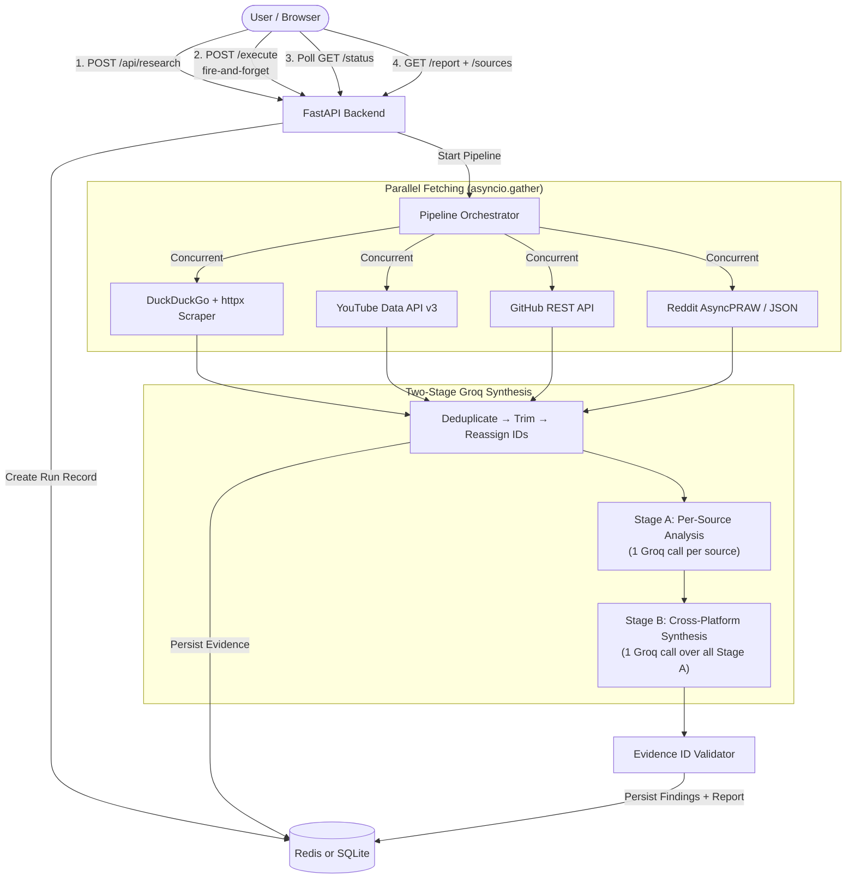

# 📡 SignalMap AI — Autonomous Market & Tech Intelligence Engine

> **Every claim mathematically traceable to hard evidence.** Concurrently crawls Web, YouTube, GitHub, and Reddit to synthesize structured, evidence-backed market intelligence using two-stage Groq LLM synthesis — deployed serverless on Vercel with Redis-backed durable state.

[](https://signalmap-ai-two.vercel.app/)


---

## 🌟 Key Features

### 🌐 Multi-Source Concurrent Ingestion
Four async fetchers run in parallel via `asyncio.gather()`, each producing typed `Evidence` objects:

| Source | How It Works | Data Extracted |
|--------|-------------|----------------|
| **Web** | Live DuckDuckGo HTML search → `httpx` + `BeautifulSoup4` scraping | Page title, meta description, headings, body text, internal links |
| **YouTube** | YouTube Data API v3 (search + statistics endpoints) | Video title, description, channel, view/like/comment counts, publish date |
| **GitHub** | GitHub REST API (search repos by stars) | Repo name, description, stars, forks, open issues, language, README snippet |
| **Reddit** | AsyncPRAW (OAuth) or public JSON search fallback | Post title, selftext, subreddit, score, comment count, top comments |

### 🤖 Two-Stage Groq AI Synthesis
Uses Groq's blazing-fast inference API (`llama-3.3-70b-versatile`) via the OpenAI-compatible client:

- **Stage A — Per-Source Analysis**: One isolated Groq call per source type. Each call only sees its own evidence, producing 3–5 structured findings with the **Observation / Interpretation / Hypothesis** taxonomy.
- **Stage B — Cross-Platform Synthesis**: One Groq call over all Stage A outputs, producing an executive summary, 3 cross-platform findings, 1 non-obvious opportunity, and documented limitations.

Every LLM call uses **JSON mode** (`response_format: json_object`) at `temperature=0.3` with automatic retry on parse failure.

### 🛡️ Zero-Hallucination Evidence Lineage
- Every claim **must cite explicit evidence IDs** (e.g., `[web-001]`, `[yt-002]`, `[gh-003]`).
- Post-synthesis **Evidence ID Validator** cross-checks all cited IDs against real evidence. Invalid citations get their confidence score **penalized by −0.3**.
- Interactive UI allows clicking any citation tag to highlight and jump to the raw evidence source with direct external links.

### ⚡ Dual Execution Modes
- **Serverless (Vercel)**: `POST /api/research` creates the run → client fires `POST /api/research/{id}/execute` (fire-and-forget) → client polls `GET /api/research/{id}` for status updates. Pipeline runs inside the execute request with a 260s timeout.
- **Local Dev + Arq Worker**: Pipeline jobs are enqueued to **Arq + Redis** for distributed background processing. No execute endpoint needed.

### 💾 Dual-Backend Durable Store
- **Redis** (Upstash / Redis Cloud): Used on Vercel where `/tmp` SQLite is per-instance and unreliable. All data stored as JSON blobs with 7-day TTL.
- **SQLite** (`aiosqlite`): Used for local development. Schema auto-initialized from `schema.sql` on first boot.

The store layer auto-detects: if `REDIS_URL` points to a remote host, Redis is used; otherwise it falls back to SQLite.

### 🎨 Modern Dark Glassmorphic UI
- Built with **React 18**, **Vite 5**, and **custom Vanilla CSS** design tokens.
- Live pipeline progress stepper with 2-second status polling and smooth micro-animations.
- Evidence drawer with clickable citation tags linking to raw source data and external URLs.

---

## 🏗️ System Architecture



---

## 🔬 How Two-Stage Synthesis Works

### Stage A — Per-Source Extraction
Each source's evidence is analyzed in isolation. The LLM produces structured findings:

```json
{
  "source": "youtube",
  "findings": [
    {
      "claim": "Video reviews show 85% positive sentiment toward the product's developer experience",
      "claim_type": "observation",
      "evidence_ids": ["yt-001", "yt-003"],
      "confidence": 0.85,
      "source_category": "community_sentiment"
    }
  ],
  "source_summary": "YouTube coverage reveals strong developer enthusiasm with growing tutorial ecosystem."
}
```

### Stage B — Cross-Platform Synthesis
All Stage A outputs are fed into a single synthesis call that identifies:

| Output | Purpose |
|--------|---------|
| `executive_summary` | 3–5 sentence actionable intelligence brief |
| `cross_platform_findings` | 3 insights spanning multiple sources (e.g., "GitHub activity contradicts official messaging") |
| `opportunity` | 1 non-obvious, evidence-backed strategic gap |
| `limitations` | Sources that were unavailable or returned errors |

### Claim Taxonomy

| Type | Meaning | Confidence |
|------|---------|------------|
| **Observation** | Directly supported by evidence text | High (0.7–1.0) |
| **Interpretation** | Reasonable inference from evidence | Medium (0.4–0.7) |
| **Hypothesis** | Theory needing further validation | Lower (0.1–0.4) |

---

## 🛠️ Technology Stack

| Layer | Technologies |
|:------|:-------------|
| **Frontend** | React 18, Vite 5, React Router DOM v6, Lucide React, Axios, Vanilla CSS3 (Glassmorphism + Dark Theme) |
| **Backend API** | Python 3.11+, FastAPI 0.115, Pydantic v2, SlowAPI (Rate Limiting), Structured JSON Logging |
| **Database** | SQLite (`aiosqlite`) for local dev · Redis (`redis.asyncio`) for serverless |
| **AI / LLM** | Groq API (`llama-3.3-70b-versatile`), OpenAI Python Client (pointed at Groq endpoint) |
| **Fetchers** | HTTPX, BeautifulSoup4, DuckDuckGo HTML Search, YouTube Data API v3, GitHub REST API v3, AsyncPRAW |
| **Task Queue** | Arq + Redis (optional, for local worker mode) |
| **Deployment** | Vercel Serverless (`@vercel/python` + `@vercel/static-build`), ASGI path-preserving shim |

---

## 📂 Project Structure

```text
SignalMap AI/
├── api/
│   └── index.py                 # ASGI path-preserving shim for Vercel serverless
│
├── backend/
│   ├── fetchers/
│   │   ├── website.py           # DuckDuckGo search + httpx/BeautifulSoup scraper
│   │   ├── youtube.py           # YouTube Data API v3 (search + statistics)
│   │   ├── github.py            # GitHub REST API (repo search by stars)
│   │   └── reddit.py            # AsyncPRAW OAuth or public JSON fallback
│   ├── config.py                # Pydantic BaseSettings (auto .env loading)
│   ├── database.py              # SQLite connection manager
│   ├── llm.py                   # Groq client, Stage A/B runners, evidence validator
│   ├── main.py                  # FastAPI app, CORS, rate limiting, endpoints
│   ├── models.py                # Pydantic schemas, enums (SourceType, ClaimType, etc.)
│   ├── normalizer.py            # Deduplicate → trim → reassign sequential evidence IDs
│   ├── prompts.py               # Engineered Stage A & B system/user prompts
│   ├── schema.sql               # SQLite DDL (research_runs, evidence, findings, reports)
│   ├── store.py                 # Dual-backend store (Redis ↔ SQLite auto-detection)
│   └── worker.py                # Full pipeline orchestrator (fetch → normalize → analyze → synthesize)
│
├── frontend/
│   ├── src/
│   │   ├── components/
│   │   │   ├── Header.jsx       # App navbar with branding
│   │   │   ├── PipelineStepper.jsx  # Real-time pipeline progress tracker
│   │   │   └── EvidenceCard.jsx # Citation evidence card with direct URLs
│   │   ├── pages/
│   │   │   ├── Home.jsx         # Research target input form (company, URL, mode)
│   │   │   ├── Status.jsx       # Live polling stepper (2s interval)
│   │   │   └── Report.jsx       # Full intelligence report with evidence drawer
│   │   ├── services/
│   │   │   └── api.js           # Axios API client (create → execute → poll → report)
│   │   ├── App.jsx              # React Router setup
│   │   ├── index.css            # Design tokens, dark theme, glassmorphism
│   │   └── main.jsx             # Vite entry point
│   ├── index.html               # HTML shell (Plus Jakarta Sans + JetBrains Mono fonts)
│   ├── package.json
│   └── vite.config.js           # Dev proxy (/api → localhost:8000)
│
├── vercel.json                  # Vercel deployment config (builds + routes)
├── requirements.txt             # Python dependencies
├── .env.example                 # Environment variable template
└── README.md
```

---

## 🚀 Quickstart Guide

### Prerequisites
- **Python 3.11+**
- **Node.js 18+** & **npm**
- **Groq API Key** — Free at [console.groq.com](https://console.groq.com)

### 1. Clone & Setup Environment

```bash
git clone https://github.com/Avvud/signalmap.ai-.git
cd signalmap.ai-

# Create .env from template
cp .env.example .env
# Edit .env and add your API keys
```

### 2. Configure API Keys

Edit `.env` with your keys:

```env
# Required
GROQ_API_KEY=gsk_your_key_here
GROQ_TEXT_MODEL=llama-3.3-70b-versatile

# Optional (enables richer data sources)
YOUTUBE_API_KEY=your_youtube_api_key
GITHUB_TOKEN=ghp_your_token_here
REDDIT_CLIENT_ID=your_client_id
REDDIT_CLIENT_SECRET=your_client_secret

# Storage (local dev uses SQLite by default)
DATABASE_PATH=./signalmap.db
REDIS_URL=redis://localhost:6379/0
```

### 3. Start Backend

```bash
python -m venv .venv

# Windows
.\.venv\Scripts\activate
# macOS/Linux
source .venv/bin/activate

pip install -r requirements.txt
uvicorn backend.main:app --reload
```

Backend API runs at **`http://localhost:8000`** — interactive docs at `/docs`.

### 4. Start Frontend

In a second terminal:

```bash
cd frontend
npm install
npm run dev
```

Frontend runs at **`http://localhost:3000`** with API proxy to `:8000`.

---

## ☁️ Vercel Deployment

### Environment Variables

Set these in your Vercel project dashboard → Settings → Environment Variables:

| Variable | Required | Description |
|----------|----------|-------------|
| `GROQ_API_KEY` | ✅ | Groq API key for LLM synthesis |
| `REDIS_URL` | ✅ | Remote Redis URL (e.g., Upstash `rediss://...`) — **required for serverless** |
| `YOUTUBE_API_KEY` | Optional | YouTube Data API v3 key |
| `GITHUB_TOKEN` | Optional | GitHub personal access token |
| `REDDIT_CLIENT_ID` | Optional | Reddit OAuth client ID |
| `REDDIT_CLIENT_SECRET` | Optional | Reddit OAuth client secret |

> ⚠️ **Redis is required on Vercel.** Without it, each serverless instance writes to its own ephemeral `/tmp/signalmap.db`, so status polling from a different instance sees an empty database. Use [Upstash](https://upstash.com) (free tier) or Redis Cloud.

### How Serverless Execution Works

Vercel freezes the execution environment the moment an HTTP response is sent, so `asyncio.create_task()` doesn't work. Instead:

1. `POST /api/research` — Creates the run record in Redis and returns immediately.
2. `POST /api/research/{id}/execute` — The frontend fires this as fire-and-forget. The pipeline runs **inside this request** with a 260-second timeout, holding the connection open.
3. `GET /api/research/{id}` — The frontend polls this every 2 seconds for status updates (`queued` → `fetching_sources` → `normalizing` → `analyzing` → `synthesizing` → `completed`).
4. `GET /api/research/{id}/report` — Fetches the final report once status is `completed`.

### ASGI Path Shim (`api/index.py`)

Vercel's Python runtime rewrites all `/api/*` paths to `/api/index.py`, passing the original path as a `__p` query parameter. The shim extracts `__p`, restores `scope['path']`, and forwards to FastAPI — so all routes work correctly.

---

## 📡 API Reference

### Create Research Run
```http
POST /api/research
Content-Type: application/json

{
  "company_name": "FastAPI",
  "website_url": "https://fastapi.tiangolo.com",
  "research_question": "What is their competitive position?",
  "mode": "full"
}
```

**Modes:** `full` (all sources) · `content` (web + YouTube) · `developer` (GitHub only) · `messaging` (website only)

**Response:**
```json
{
  "run_id": "2d210848-131d-4100-89eb-cd79339601ff",
  "company_name": "FastAPI",
  "status": "queued"
}
```

### Execute Pipeline (Serverless)
```http
POST /api/research/{run_id}/execute
```
Fire-and-forget. Holds connection open while pipeline runs (up to 260s).

### Poll Status
```http
GET /api/research/{run_id}
```
Returns current `status`: `queued` → `fetching_sources` → `normalizing` → `analyzing` → `synthesizing` → `completed` / `failed`

### Get Report
```http
GET /api/research/{run_id}/report
```
Returns executive summary, all findings with evidence citations, opportunity, and limitations.

### Get Evidence Store
```http
GET /api/research/{run_id}/sources
```
Returns all raw evidence items collected during the research run with source URLs.

### Health Check
```http
GET /health
```
Returns `{ "status": "ok", "app": "SignalMap AI", "store": "redis" | "sqlite" }`.

---

## 🔒 Anti-Hallucination Safeguards

| Layer | Mechanism |
|-------|-----------|
| **Prompt Engineering** | Strict Observation/Interpretation/Hypothesis taxonomy enforced in system prompts. LLM instructed to never fabricate — state "unavailable" if evidence is thin. |
| **JSON Mode** | All Groq calls use `response_format: json_object` with structured output schemas. Auto-retry with error-correction prompt on parse failure. |
| **Evidence ID Validation** | Post-synthesis validator checks every cited `evidence_id` against the real evidence store. Invalid citations get confidence penalized by −0.3. |
| **Content Normalization** | Evidence is deduplicated by URL, trimmed to 1,500 chars, and assigned sequential IDs (`web-001`, `yt-002`, etc.) before reaching the LLM. |

---

## 📊 Database Schema

Four tables with foreign key cascades:

| Table | Purpose |
|-------|---------|
| `research_runs` | Run metadata, status tracking, error messages |
| `evidence` | Raw + normalized evidence items from all sources |
| `findings` | Individual claims with claim type, confidence, evidence citations |
| `reports` | Executive summary, cross-platform findings, opportunity, limitations |

---

## 🤝 Contributing

1. Fork the repository
2. Create a feature branch (`git checkout -b feature/new-source`)
3. Commit your changes (`git commit -m 'Add new data source'`)
4. Push to the branch (`git push origin feature/new-source`)
5. Open a Pull Request

---

## 📝 License

Distributed under the MIT License. See `LICENSE` for details.

---

<p align="center">
  Built with ❤️ for Market Intelligence & Tech Competitor Analysis<br/>
  <a href="https://signalmap-ai-two.vercel.app/">Live Demo</a> · <a href="https://github.com/Avvud/signalmap.ai-">GitHub</a>
</p>
